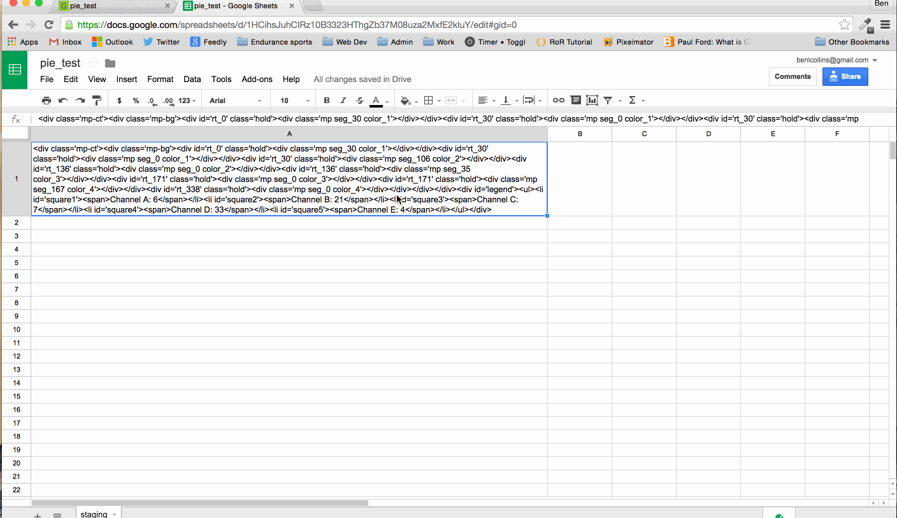

# CSS Pie Charts for Geckoboard

http://www.benlcollins.com/front-end-development/pie-charts-in-geckoboard-with-google-sheets/

## Introduction

This project originated from a client project to build a custom Geckoboard dashboard based off Google Sheets data and including several pie charts. But at the moment, Geckoboard doesn’t come with a pre-built pie chart option for data that comes from Google sheets. So, I created this pure CSS workaround that utilizes Geckoboard's text widget for display.

## What you need

You’ll need three things:

A text widget in your Geckoboard dashboard, 
A google spreadsheet with the data for your pie chart, 
A custom CSS file, 

Then it’s simple process to link the Geckoboard text widget to your Google spreadsheet, and upload the custom CSS file:

## How it works

At the heart of this technique is the humble text widget that Geckoboard offers. It pulls in text data from a single cell of a Google spreadsheet and allows you to include certain HTML tags. This is the crucial piece that allows us to turn the text into a pie chart. We can pass in div tags with class attributes.

Next you’ll need a Google Sheet with your pie chart data. We’ll put all of this data into a single cell, wrap it all in custom HTML div tags and then link Geckoboard to this cell. However, it won’t look much like a pie chart at this stage.

The final piece required is a custom CSS file that contains the code to style these div tags based on the class attributes. This code will turn the div elements into pie chart segments.

If we then change the class names in the google sheet we can make the pie appear “dynamic”, since the custom CSS file contains all the different classes to handle variations in segment size. In other words, if the data changes, the class attributes in the text cell of the Google Sheet change. Then Geckoboard imports the new text with the new class tags, which are then displayed differently by our CSS file and so the pie chart is updated!

## Further information

http://www.benlcollins.com/front-end-development/pie-charts-in-geckoboard-with-google-sheets/

